# 🧑‍💼 Profile Finder Chatbot

An intelligent chatbot that assists with **finding candidate profiles based on required skills**.  
This bot integrates with **Google Drive** for storing resumes/profiles, leverages **OpenAI embeddings** for semantic understanding, and uses **Pinecone** for efficient vector search.  
The bot is deployed with **n8n workflows** for automation and interacts with users via **Telegram Bot**.

## 🚀 Features
- 📂 Fetches candidate profiles stored in **Google Drive**
- 🔍 Converts resumes (PDF/DOCX) into embeddings using **OpenAI**
- 📊 Stores and searches embeddings efficiently with **Pinecone Vector DB**
- 🤖 Uses **OpenAI Chat Model** to understand queries and return relevant profiles
- 🔗 Automated workflows managed via **n8n**
- 💬 Integrated with **Telegram Bot** for easy access
- 🧑‍💼 Supports multi-format profiles (PDF, DOCX, text)

## 🛠️ Tech Stack
- **n8n** — Workflow automation  
- **OpenAI** — Embeddings & conversational responses  
- **Pinecone** — Vector DB for semantic search  
- **Telegram Bot API** — Messaging and interaction  
- **Google Drive API** — Resume/profile storage and retrieval  

## ⚙️ Architecture Flow

### 🔹 Workflow Diagram (Mermaid)

```mermaid
flowchart TD
    A[📂 Google Drive API] -->|Fetch Profiles| B[n8n Workflow]
    B -->|Extract Text & Preprocess| C[📝 Text Chunker]
    C -->|Convert to Embeddings| D[🔎 OpenAI Embeddings]
    D -->|Store & Search| E[📊 Pinecone Vector DB]
    E -->|Retrieve Matches| F[🤖 OpenAI Chat Model]
    F -->|Answer Generated| G[💬 Telegram Bot]
```


### 🔹 ASCII Flow
```
[Google Drive Profiles] --> [n8n Workflow] --> [Text Chunker] --> [OpenAI Embeddings] --> [Pinecone Vector DB]
                                                                                          |
                                                                                          v
                                                                               [OpenAI Chat Model] --> [Telegram Bot]
```

## 📦 Setup Instructions

### 1) Clone Repository
```bash
git clone https://github.com/your-repo/profile-finder-chatbot.git
cd profile-finder-chatbot
```

### 2) Environment Variables
Create a `.env` file in the project root:
```
OPENAI_API_KEY=your_openai_key
OPENAI_EMBEDDING_MODEL=text-embedding-3-small
PINECONE_API_KEY=your_pinecone_key
PINECONE_ENVIRONMENT=your_pinecone_env
PINECONE_INDEX=profile-finder
GOOGLE_DRIVE_API_KEY=your_gdrive_key
TELEGRAM_BOT_TOKEN=your_telegram_bot_token
```

### 3) Setup n8n
1. Install n8n (Docker, desktop, or server).  
2. Import the workflow JSON: `workflows/profile_finder.json`.  
3. Configure credentials for Google Drive, Pinecone, OpenAI, and Telegram.  

### 4) Deploy Pinecone Index
- Create index (e.g., `profile-finder`).  
- Dimension = `1536`.  

### 5) Run the Bot
```bash
n8n start
```

## 📌 Example Usage
- **User (Telegram):** “Find profiles with Python and SQL skills”  
- **Bot:** The following profiles match your query:  
1. *Anuradha Kumari* — Data Engineer (Python, SQL, Informatica)  
2. *Rohit Sharma* — Backend Developer (Python, Flask, SQL)  

- **User (Telegram):** “Show me profiles with cloud and data engineering experience”  
- **Bot:** The following profiles match your query:  
1. *Seema Vishwas* — Cloud Data Engineer (AWS, Snowflake, Python)  
2. *Tusar Kumar* — Senior Data Engineer (Azure, Databricks, SQL)  

## 🛠️ Troubleshooting
- **Profiles not retrieved:** Check Google Drive API connection.  
- **Bot not responding:** Verify Telegram bot token in n8n.  
- **No profile matches:** Ensure profiles are processed and stored in Pinecone.  
- **Dimension mismatch error:** Ensure Pinecone index matches embedding model.  

---

# 👨‍💻 Author
Built by **Your Name** using automation, AI, and profile search integrations.
